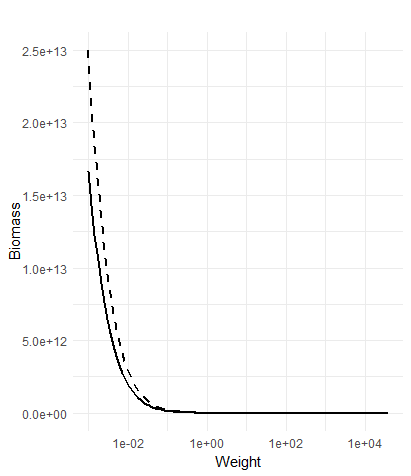
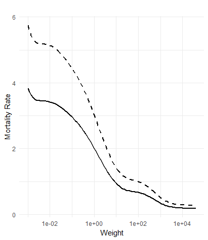

```{r, include=FALSE}
knitr::opts_chunk$set(
  collapse = TRUE,
  comment  = "#>"
)
```

## Introduction

The purpose of this shiny app is for the use of mizer models and the analysis of their outcomes without the need for any coding. Each plot acts as a comparison between the outcome of the user imposed changes and a baseline simulation. The range of plots allows for a depth of analysis; ecosystem changes can be investigated through species abundances, community size spectrum, species diet and feeding guild changes, additionally with the possibility of analysing across the temporal domain. Observation of ecosystem trade-offs can be investigated too, with a comprehensive ecosystem yield dashboard and a plot of the nutritional quality of yield. 

[Mizer](https://besjournals.onlinelibrary.wiley.com/doi/full/10.1111/2041-210X.12256) is a multi-species, size resolved, mechanistic ecosystem model. It is the model that is being run under the hood of the app, but it is not required that you know anything about its mechanisms to use the app. If you want to learn more, follow this link to its [main page](https://sizespectrum.org/mizer/).

In the mizer software the default model is the North Sea and so it is the default within mizerShiny too. Not every species that is present in the North Sea is included, but the species that make up 90% of the North Sea biomass are. Find more information about this mizer model [here](https://besjournals.onlinelibrary.wiley.com/doi/full/10.1111/1365-2664.12238).

The general philosophy of the app is that each visualisation is made relatively, so that only comparisons are involved in any user analysis. The decision is made due to the fact that mizer is agnostic about units and that the mizer models themselves are not useful for a specific numerical answer. For example they are not able to be used to extract exact yields and biomass's, but to find out their trends and relationships. Consequently, any values acquired from mizer are relatively useless when interpreted alone. 

In nearly the whole app, the user's mizer simulations are compared to a base mizer simulation. The base mizer simulation is the default parameters in the mizerParams object, or is set differently by the user. Therefore it is has usually been parameterised to be in an equilibrium state, similar to the real ecosystem that it is modelling. Regardless, it is not of the utmost importance if it is not a 1:1 model of the real ecosystem, as the trophic dynamics due to the user imposed perturbations are what is worth investigating.

## Single Species

The 'Single Species' section opens on app start and is intended to allow the user to understand the trophic role of a given species and the trophic interactions that any perturbations may result in. Only one species is changed and the rest of the model is kept the same, then the user can analyse the repercussions of their imposed change. 

In the single species section, users can navigate between the 'Biomass' and 'Mortality' tabs using the header in the top left. Changing between these will mean different perturbations can be made on the ecosystem. Only one type of perturbation can be made on the model, either from the 'Biomass' or 'Mortality' panel. 

{width=50%}

### Biomass

Mizer models are usually parameterised to be in the steady state, meaning that if the model was ran, the abundance of any species would not change through time. It can be thought of as an equilibrium state, where the biomass flows between species and size classes is balanced. The 'Biomass' section allows you to change the starting biomass of one species. Therefore, you can observe which species interact with your chosen species, and how the perturbation of biomass change oscillates through time.

As mizer is size resolved and the biomass is split between different size classes and bins, the biomass is changed to reflect this size structure. The imposed change is applied to every size class, so the change observed in the ecosystem is due to the increased biomass and not a change in size structure. 

Below contains an example where the dashed line is where the biomass values have a 50% increase for each size class.

{width=50%}

To run the simulation, first you must select the time you want the simulation to run for in `Time Range` and the species that you want to select with `Select a Species`. Then, you change the `Starting Biomass`. The biomass in each size class for the chosen species is multiplied by the value given in the slider. The simulation is ran for the time you specified. The plots generated are the same as in the 'Mortality' section, so will be covered later on. 

{width=200px}

### Mortality

The mortality section works in a very similar way to the biomass, but instead the change imposed is constant throughout the simulation. At the starting conditions, due to predation, fishing and external mortality (starvation and unmodelled species), each size class of each species is subject to a mortality rate, specifically how much of the biomass in that size class is removed from the size class. The value of mortality for each size class for the chosen species is multiplied by the value chosen on the slider, and then this is added to each size class. The mortality you have added is then imposed on the chosen species for the entirety of the simulation. It is the same value of mortality across all time, so for example a value of 0.05 is not a 5% increase in mortality at every time point, it is an increase of 5% of the initial mortality rate at every timepoint. The distinction here is that the mortality will change across the simulation, as it is due to the predation and fishing, both of which change across the simulation. 

See the example below, where the black line is the mortality rate of one species at the start of the simulation, and the dashed line is that mortality with an additional 50%. The difference between the these two lines would be added on to the chosen species for every time step in the simulation. 

{width=50%}

As seen below, the value ranges from -0.5 to 0.5. The value is multiplied by the mortality at the start, then added on. So a value of 0.05 will add approximately 5% mortality. It is possible to create a negative mortality rate, whereby biomass will be added to the simulation.

{width=200px}

After setting the conditions in the panel, press Run Simulation, then look at the plots on the right. The plots are explained below

### Plots

Navigate between the plots pressing the tabs at the top. Each plot uses [plotly](https://plotly.com/r/), meaning that you can zoom in by selecting an area, zoom out by double clicking, save a plot in the top right of the plot panel and hover over plot sections to get exact information. Additionally, by clicking on the information in the legend, you can drop unwanted information.

{width=50%}

### Species

The 'Species' plot visualises the change in species biomass between the base mizer simulation and the changed mizer simulation at the time point chosen. The colour indicates if the change was negative or positive. Three time points are plotted, the chosen time point, a time 1/2 of the chosen, and 2x the chosen. The shade indicates the time point, from darkest to lightest indicating 1/2 of the time point, the chosen time point and 2x the time point. Plotting multiples point in time across the simulation helps to understand the oscillatory nature of trophic interactions. 

It is possible on this plot to change the order of species on the X axis, done so using the choice box below the plot. Clicking custom allows the user to decide the order, but the user can also choose Preset, Guild, Size. Changing the order allows for easier analysis of trophic interactions between species.

{width=50%}

### Size

The size tab informs the user of ecosystem wide changes to the size spectrum. The size spectrum is the distribution of biomass, or individuals, across sizes. Size is a very important aspect to marine ecosystems, it relates to what fish can eat and how fast they can swim. The plot found here is the community size spectrum, so this shows the change in biomass at each size for every species of fish. It is useful for looking at broader trends and to observe trophic cascades, whereby a decrease in one size leads to an increase in its prey size, or the converse.

Use the log button to log / unlog the X axis. A logged X axis allows for greater resolution of the larvae sizes.

{width=50%}

### Guild

Guild stands for 'Feeding Guild', which is a characterisation of respective fish species and their life stages into similar trophic groups where they have similar roles in the ecosystem. It is useful for looking as to how ecosystem dynamics may be changing. 

Similarly to the 'Species' section, each feeding guild is plotted relative and across multiple timescales. 

The information about where the guilds come from and how they can be calculated is from [Murray et al. 2022](https://oap-cloudfront.ospar.org/media/filer_public/a1/73/a173bfad-42b0-4f87-ab5d-e1cd5d2574d1/p00856_pilot_assessment_feeding_guild_qsr23.pdf) - Pilot Assessment of Feeding Guilds.

{width=50%}

## Changing Time

For every part in the app, it is possible to change the time that is plotted without having to rerun the simulation itself. When you run the simulation, the `Time Range` slider will be shortened to the time that you chose, a `+1 year` / `-1  year` button and a `Reset Time` button will be added. Now, if you change the `Time Range`, it will keep the same simulation, but change the year that you are plotting, so it is much faster than running mizer again. The `+1 year` / `-1  year` buttons do the same but make it easier to change at a smaller scale. 

To rerun a simulation, you must press `Reset Time` to make the `Time Range` slider act as as it did previously, otherwise you will not be able to run the simulation further in time than the previous.

{width=50%}

### Time

Each plot in the app plots the time over a 3 year period, so +1 and -1 the year that the user chose. It is coded as such because plotting a single year will plot the peaks or troughs of an oscillation, so means that an outlier year will cloud analysis. Therefore, plotting the mean over 3 years will present a better idea of the effect of the perturbation.

## Fishing Strategy

The next main section of the app can be accessed from the top of the page. It allows the user to change the fishing effort imposed by the fleets in the mizer model. Fleets in mizer generally try to model vessels which select approximately the same size classes and species of fish. Then, the fishing effort that this fleet imposes on the ecosystem can be changed. This is what this section does, allows you to change the fishing effort away from the current fishing mortality. 

Find more information about how fishing works in mizer [here](https://sizespectrum.org/mizer/reference/newMultispeciesParams.html?q=fishing#setting-fishing)

Additionally, in this section you can compare 2 different fishing strategies and observe the difference. Each plot will change depending on whether you have decided to compare strategies or run one strategy. Even if you are comparing strategies, both will be plotted relative to the current fishing strategy. Generally, the second simulation you choose will be a dashed line, whereas the first is a solid line.

Use the sliders in the panel to change the fishing fleets. 


{width=200px}

Scroll past this to run the simulation.

### Plots

The fishery strategy section contains the same plots as the Single Species, but more. 

### Yield

'Yield' contains a yield dashboard, showing different aspects of the yield that is taken from the fish populations. It contains plots for the species and fleet compositions of yield and their change over time. It also shows the total yield. When you compare 2 fishery strategies, each plot will contain another bar plot or a dashed line, but will remain the same. 

There is a full description in the 'Legend'.

In this section it is useful to remember that plotly allows you to click away unwanted information that is included in the plot. If you only want to look at one species, you can double click it on the legend to remove all other species, and click them to add them back. (Also, there are multiple legends combined into one, so there will be multiple instances of a each species)

It is also possible to average yield over chosen years using the slider 'Time Range' below the plot. It will only plot the total yield over the years you have chosen, so that you are able to analyse how it changes. 

{width=50%}

### Spectra

The spectra plot is similar to the 'size' plot outlined prior, but it does not plot all species together, it separates each spectrum into each species. It is useful to look at how different fishing strategies effect species of different sizes, but can be difficult to recognise changes due to the large range of biomass that is plotted. 

The X axis can be controlled by the log button. 

{width=50%}

It is possible to use the plotly functionality here in conjunction with the 'Time Range' slider. Click on species in the legend to remove them, and double click them to remove other species. Then, you can change the time plotted to see how the size spectrum of a species develops over a fishing strategy. 

{width=50%}

### Diet

Understanding how the ecosystem dynamics may change due to fishing must involve looking at the changing diet of fish, as it can inform you of the causes behind the ecosystem effects. For example a decrease in two prey species of a given predator species, following increased fishing on only one of the prey species, may be due to the predator species having to eat more of the other prey species due to fishery-caused decline in their primary prey.

In the 'diet' plot, you choose the species that you want to investigate, and it will plot what species contribute to its diet across the species size. It will include a 'resource' species, which is a very general model of the plankton which the smaller sizes of fish need for food. 

{width=50%}

The legend can be utilised here to find out specific changes, as it is difficult to analyse from the plot alone. Selecting only one species by double clicking the legend will allow direct comparison. The plot below shows that if Plaice were to have higher starting biomass, Sole would eat less Sprat (only by a little), as it has more Plaice to eat. 

{width=50%}

### Nutrition

The nutritional quality of the catch can be observed in this tab, it works by taking nutritional information per 100g of each species, and multiplying the species composition of the catch by these values to get the total nutrient amount. It is then compared against the current fishing scenario. The plot must be analysed with care, as it works off biomass values, if there is a higher total catch, it will have a greater nutritional value, not because the species caught are better nutritionally. It is best to use this in company with the yield plot. 

The values of nutrition are taken from various databases, which is outlined in the READme file in the nutrition folder.

{width=50%}
